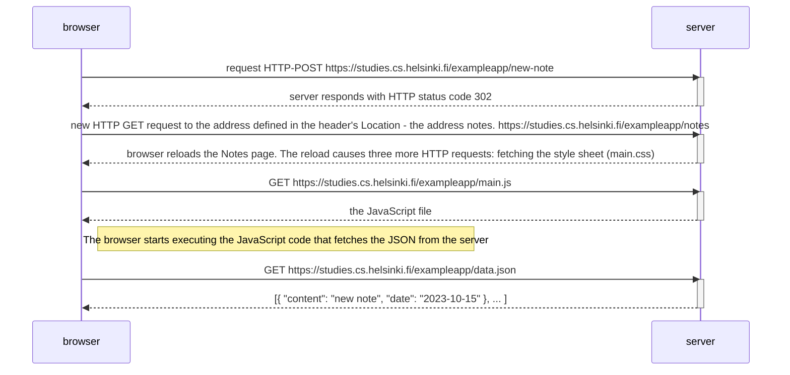
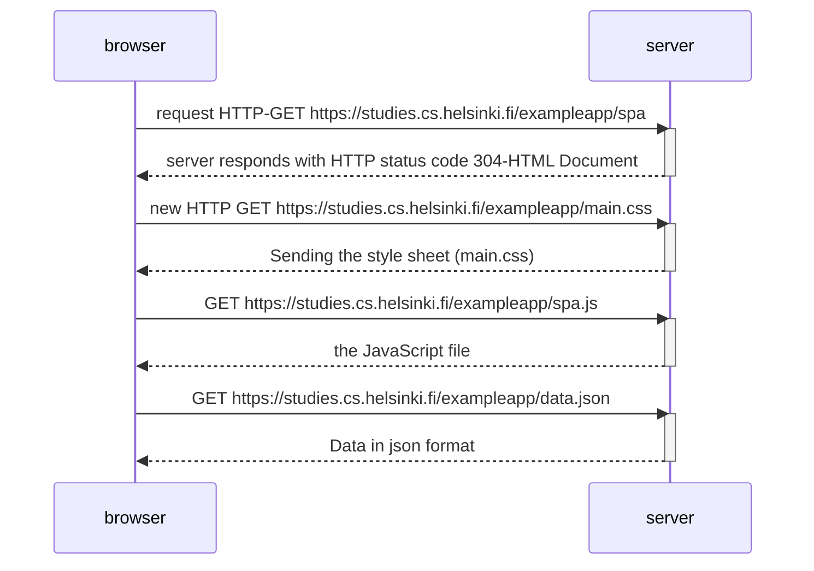
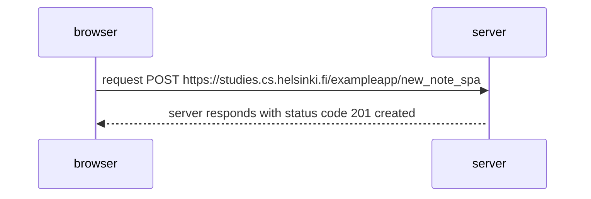

```mermaid
sequenceDiagram
    participant browser
    participant server

    browser->>server: request HTTP-POST https://studies.cs.helsinki.fi/exampleapp/new-note
    activate server
    server-->>browser: server responds with HTTP status code 302
    deactivate server

    browser->>server: new HTTP GET request to the address defined in the header's Location - the address notes. https://studies.cs.helsinki.fi/exampleapp/notes
    activate server
    server-->>browser: browser reloads the Notes page. The reload causes three more HTTP requests: fetching the style sheet (main.css)
    deactivate server

    browser->>server: GET https://studies.cs.helsinki.fi/exampleapp/main.js
    activate server
    server-->>browser: the JavaScript file
    deactivate server

    Note right of browser: The browser starts executing the JavaScript code that fetches the JSON from the server

    browser->>server: GET https://studies.cs.helsinki.fi/exampleapp/data.json
    activate server
    server-->>browser: [{ "content": "new note", "date": "2023-10-15" }, ... ]
    deactivate server

```

```mermaid
sequenceDiagram
    participant browser
    participant server

    browser->>server: request HTTP-GET https://studies.cs.helsinki.fi/exampleapp/spa
    activate server
    server-->>browser: server responds with HTTP status code 304-HTML Document
    deactivate server

    browser->>server: new HTTP GET https://studies.cs.helsinki.fi/exampleapp/main.css
    activate server
    server-->>browser: Sending the style sheet (main.css)
    deactivate server

    browser->>server: GET https://studies.cs.helsinki.fi/exampleapp/spa.js
    activate server
    server-->>browser: the JavaScript file
    deactivate server

    browser->>server: GET https://studies.cs.helsinki.fi/exampleapp/data.json
    activate server
    server-->>browser: Data in json format
    deactivate server

```

```mermaid
sequenceDiagram
    participant browser
    participant server

    browser->>server: request POST https://studies.cs.helsinki.fi/exampleapp/new_note_spa
    activate server
    server-->>browser: server responds with status code 201 created

    
```